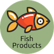
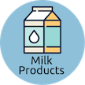
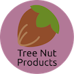
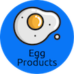
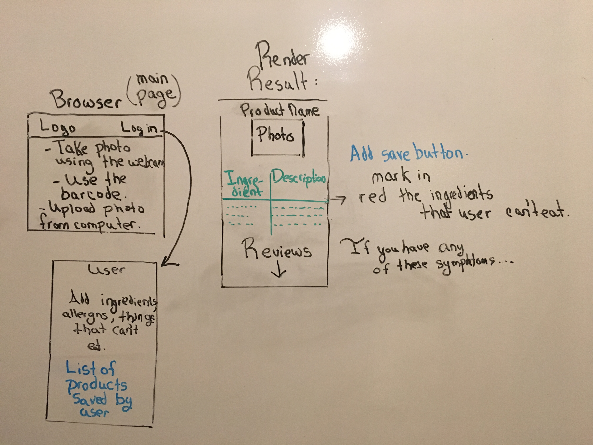
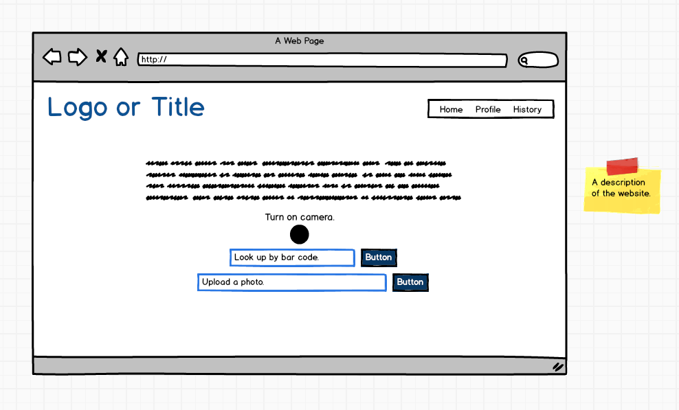
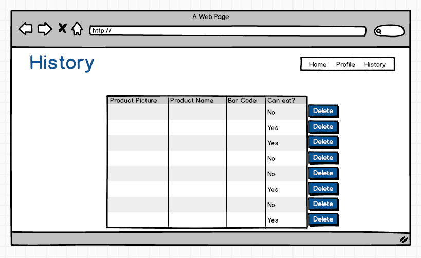
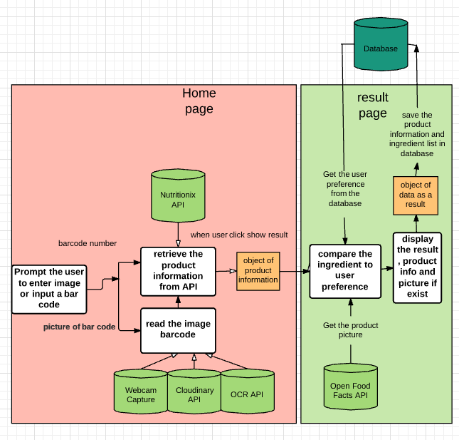

<a name="goback">

# Project 3 (Can I Eat This?)
## Live: https://icaneatthis.herokuapp.com

</a>

### Team: Esraa, Francheska, Naomi

## Table of Contents

1. [App description](#appdescription)
2. [User Stories](#userstories)
3. [Wireframes Web Version](#wireframesweb)
4. [Wireframes Mobile Version](#wireframesmobile)
5. [Visual representation of the database](#database)
6. [Pseudocode](#pseudocode)
7. [APP flowChart](#workflow)
8. [ERD or other visual representation of your database](#database)
9. [Technologies used](#technologies)
10. [Ways to see the project](#project)

<a name="appdescription">

## APP DESCRIPTION:

An app for people who care about the ingredients in their food!

Step 1: Users register their dietary restrictions on the user preferences page and can save their issues. Such as allergies to peanuts or shellfish, lactose intolerant, gluten-free, or other specific dietary restrictions. 

-	Current allergen list:

	-	Peanut
	-	Tree Nuts
	-	Milk (lactose intolerant)
	-	Egg
	-	Wheat (gluten-free)
	-	Soy
	-	Fish
	-	Shellfish
	-	Sesame

Step 2: Users quickly and easily take a picture of the barcode of a food item to check the ingredients. Using Optical Character Recognition (OCR) the app checks if any of the ingredients from the product match with any of the saved user preferences. 

Step 4: The app displays the results of the thorough ingredient check (over 60 keywords for each) and indicates whether the user can eat the item or not. Rendering each of the unique allergen issues and whether they are present in the product or not.

Step 5: In history, the user can save their past products searched and preferences, stored in an external database. 

</a>

<a name="userstories">

## USER STORIES:

- As a user, I want to use the app in the browser and on a mobile device.

- As a user, I want to see cute icons for each of my allergen preferences.
- Like this:       

- As a user, I want to add and edit the ingredients I am careful about in my User Profile.

- As a user, I want to quickly and easily take a picture of the product's barcode then and immediately see if the product contains any ingredients I don't want.

- As a user, I want the option to write the barcode (maybe is the user's preferred way for security reasons, or camera doesn't work, etc), and immediately see if the product contains any ingredients I don't want.

- As a user, I want to 'red flag' ingredients I am careful about. Such as items I am allergic to examples include: peanuts, gluten, dairy, etc. 

- As a user, when I enter the product barcode, I want to know if I'm using the wrong number of digits or letters by mistake.

- As a user, I want an editable history of all the products I already looked up.

- As a user, I want to see the product picture (if available) and see the list of ingredients.

</a>

<a name="wireframesweb">

## WIREFRAMES:
## (Web/Browser Version)

### Here is the initial thinking we started with:

### Homepage:

### Product Info:

### User Profile:

### History:

</a>

<a name="wireframesmobile">

## (Mobile Version)

### Homepage, Scan Barcode and Product Info:

### User Profile and History:

</a>

<a name="pseudocode">

## PSEUDOCODE:

1. Grab the item barcode (by scanning the UPC number, or write it in an input field)
2. Validate the barcode, 12 digits number
3. Make an axios call to find the product information (product name, ingredients)
4. Use the barcode to call another API for the picture 
5. Get the user list of allergies from the database
6. Compare the product ingredients the user’s allergies 
7. Store the comparison information from the two APIs to database 
8. Display the picture of the product if found or use a placeholder
9. Allow the user to change their list of issues, after clicking on the profile page
10. Display the previously selected issues and allow the user to modify selections 
11. If the user wants to see the previously searched items, allow user to click on History page
12. Allow the user to delete a product by clicking on X
13. For wrong links, 404 page is available.

</a>

<a name="database">

## ERD/VISUAL REPRESENTATION OF DATABASE:

</a>

<a name="technologies">

## TECHNOLOGIES USED:

### Core Stack:

- React
- Node
- Express
- PostgreSQL
- HTML
- CSS
- JavaScript
- jQuery
- Heroku
- Git

### Middleware:

- nodemon
- pg-promise
- axios
- react-routers
- cors
- bluebird
- react-webcam
- react-base64-img
- CSS Frameworks

### APIs:

- Optical Character Recognition (OCR) API
- Nutritionix API
- Open Food Facts API
- Cloudinary API

### Also

- ZenHub (project boards)
- Balsamiq (wireframes)
- Lucidchart (app/project flow)
- Slack (communication)
- Postman (API and DB testing)
- Ice-cream (for sanity :)

</a>

<a name="project">

## SEE THE PROJECT:

### Live Deployment of App: https://icaneatthis.herokuapp.com

Database hosted on Heroku:
- https://caneatthis.herokuapp.com
- To access the products information: https://caneatthis.herokuapp.com/api/information
- To access the user issues: https://caneatthis.herokuapp.com/api/allergies
- GitHub of database: https://github.com/esraa2525/canieatthis

### Download Project & Install

1. Git clone or download this project
2. Make sure to `npm install`
3. Cd to the `react` folder
4. Run `npm start` and app should be available on localhost:3000

Thanks :) 

</a>

[Go Back to the Table of Content](#goback)
